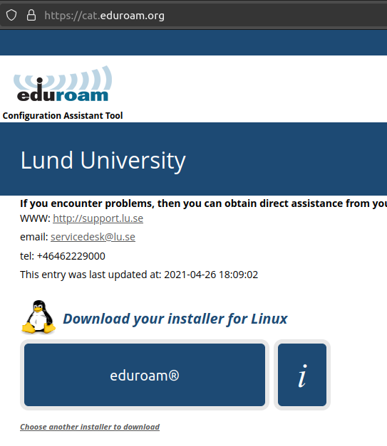
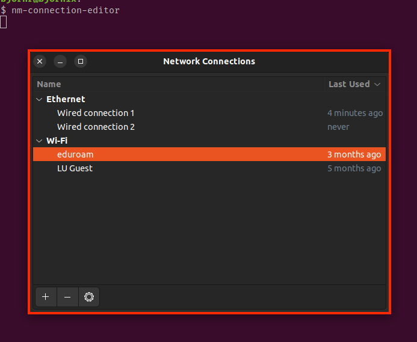
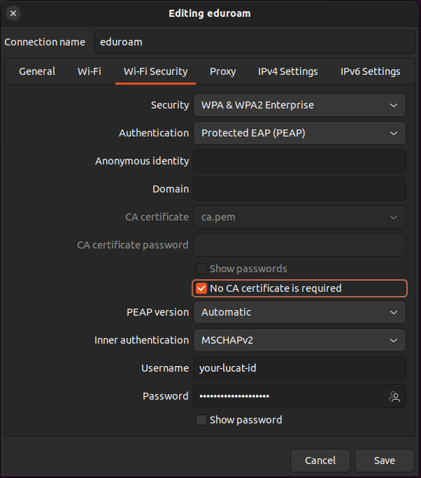

# Eduroam at Lund university

## Download and install

1. Download latest installer for your organisation linux from here in a file with any name (below denoted `the_file`):  
https://cat.eduroam.org/

    


2. Run these commands in terminal
    ```
    chmod +x the_file
    python3 the_file
    ```

3. In the dialog that pops up enter lucatid and password and make sure to use `@lu.se` after your lucat id 


## Change password

When you have updated your password in Lucat via Passport then you need to change it in eduroam.

1. Open a terminal and type the command `nm-connection-editor`

2. In the dialog that opens select `Eduroam` and press the cog wheele at the bottom of the window.



3. In the `WiFi Security` tab change the password and check "No CA certificate required".



4. Press `Save`

