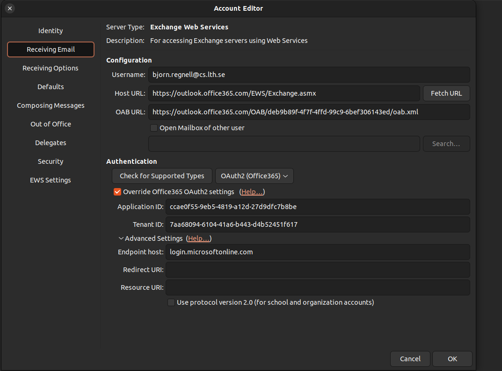
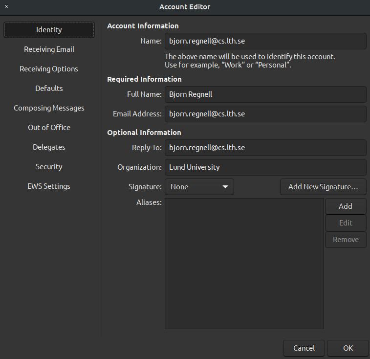
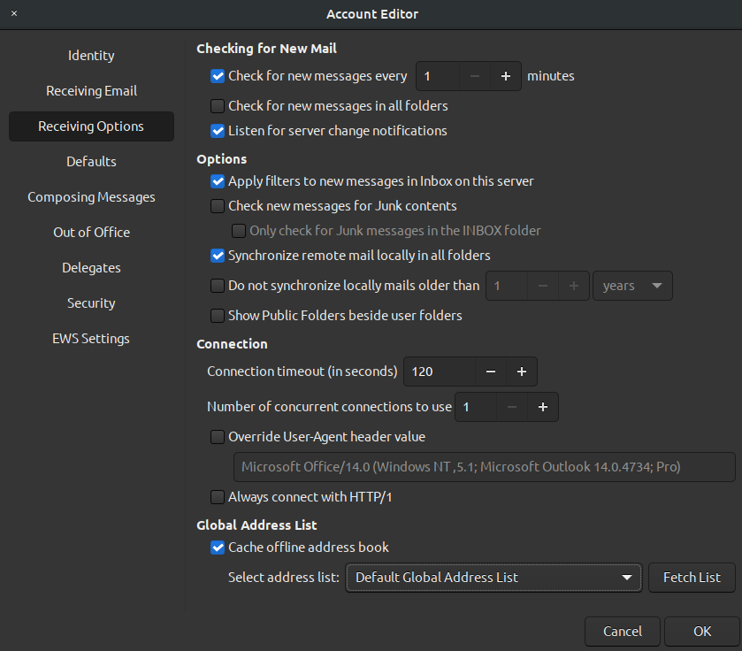
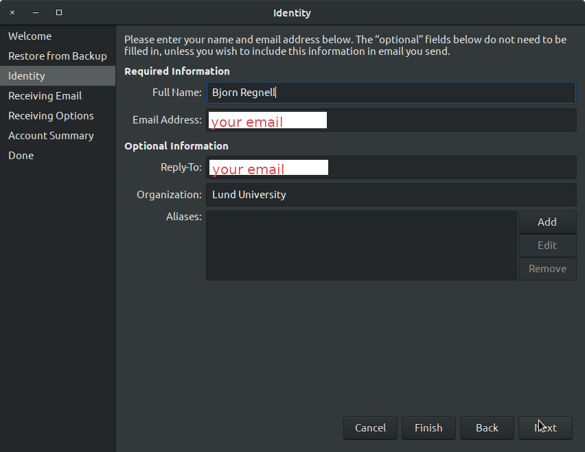
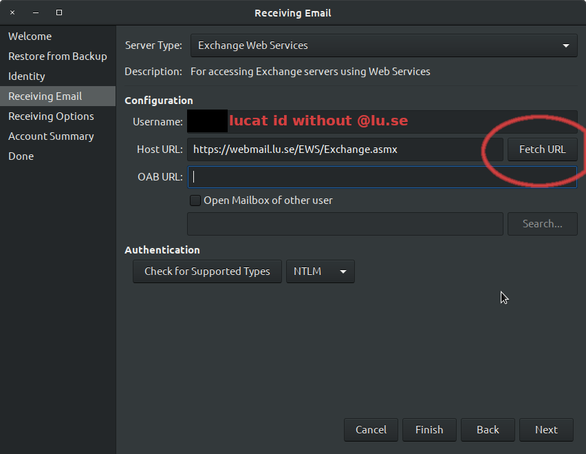
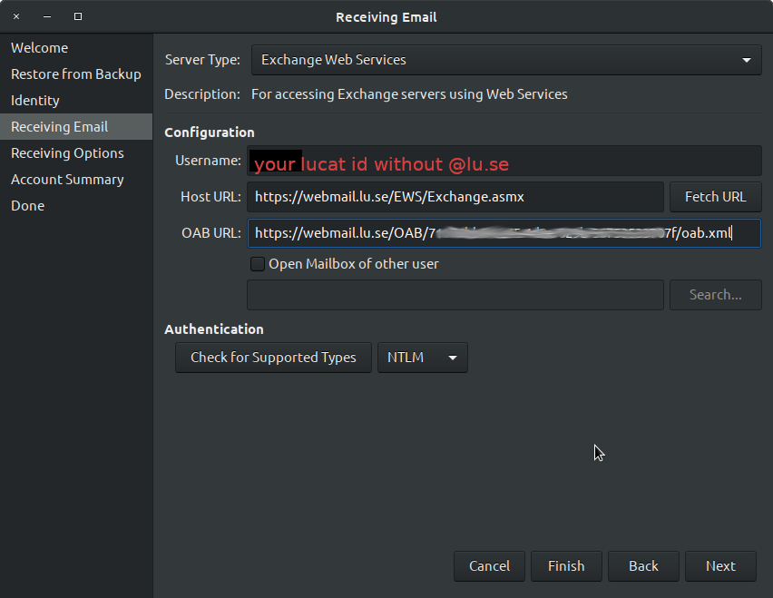
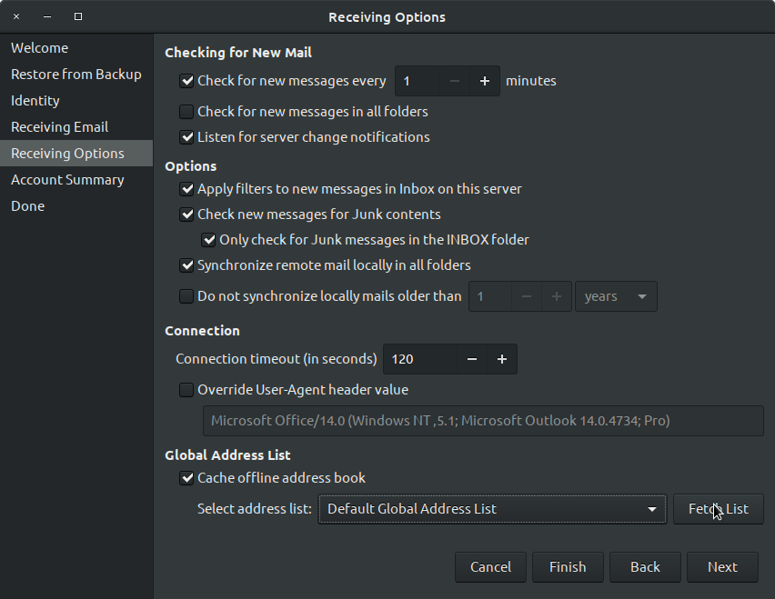
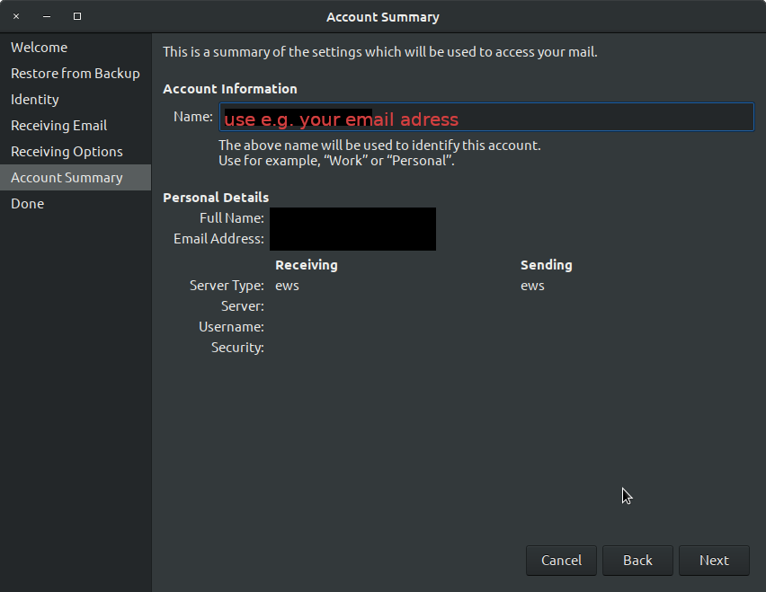

# Install and configure the Gnome Evolution email client

Gnome Evolution is an email client for Linux/Ubuntu that works with Microsoft Exchange servers.

It is easiest to configure using a backup of your existing Evolution instance on another machine as described below (if you have one). Otherwise, if you are doing a fresh install, use the settings below, see esp. the settings for OAuth2 below if your organisation uses that with Microsoft Office365. 

The configuration examples below are for employees and students at Lund University, Sweden - the configurations need to be adjusted according to your specifics if you are with another organisation.

## Install flatpak version of Gnome Evolution

Install flatpak and flathub, see  https://www.omgubuntu.co.uk/2019/02/how-to-install-flatpak-on-ubuntu-flathub and https://wiki.gnome.org/Apps/Evolution/Flatpak
```
sudo add-apt-repository ppa:alexlarsson/flatpak

sudo apt update && sudo apt install flatpak

flatpak remote-add --if-not-exists flathub https://flathub.org/repo/flathub.flatpakrepo

sudo apt install gnome-software-plugin-flatpak

flatpak install flathub org.gnome.Evolution
flatpak config --set languages 'en;sv'

```


### Why not install with apt?

The Ubuntu package manager `apt` is not recommended as it installs an old version that does seem not to be updated with the latest MS Exchange stuff. It might for example give this strange error: 

`Error performing TLS handshake: The Diffie-Hellman prime sent by the server is not acceptable (not long enough)`

So I have found that THIS DOES NOT WORK: *sudo apt update && sudo apt install evolution evolution-ews* - so instead use the flatpak version as described in the previous section.


## Bootstrap form existing install

If you have another machine where you already have a working Gnome Evolution instance you can bootstrap another machine like so:
   * On the existing working installation: File -> Back up Evolution Data
Save file somewhere and transfer to this machine and use "Restore from backup in the wizard" or do:
   * On the new machine: File -> Restore Evolution Data

If you don't have a working installation continue with manual settings for OAuth2 below.


## Settings for OAuth2 at Lund University

### Settings for "Receiving Email" 

In "Configuration" enter:
* Username: `your.email@your.domain`  (NOTE for Lund University employees/students: don't use your LucatID but your real email address)
* Host URL: `https://outlook.office365.com/EWS/Exchange.asmx`

Check "Override Office365 settings" and enter the settings for Application ID and Tenant ID for your organisation. 

For Lund University, Sweden these settings are:

* Lund University Application ID: `ccae0f55-9eb5-4819-a12d-27d9dfc7b8be` 
* Lund University Tenant ID `7aa68094-6104-41a6-b443-d4b52451f617`

NOTE: These settings will not work if you are not an employee or student at Lund University with a LucatID - instead you may find your own organization's Application ID and Tenant ID by logging into your organization's MS Azure instance and look under Applications -> App Registrations and in the long list find the hash of `mail-oauth` as Application ID  [here](https://entra.microsoft.com/#view/Microsoft_AAD_RegisteredApps/ApplicationsListBlade/quickStartType~/null/sourceType/Microsoft_AAD_IAM )  and your Tennant ID [here](https://entra.microsoft.com/#view/Microsoft_AAD_IAM/TenantOverview.ReactView).

After entering Application ID and Tenant ID press the **Fetch URL** button. You should then be prompted by a login popup. NOTE: if you are with Lund University, you should use your Lucat ID followd by `@lu.se` and after successful authentication you should get an URL automatically in the **OAB URL** field starting with `https://outlook.office365.com/OAB/` then a hash (I got this hash: `deb9b89f-4f7f-4ffd-99c9-6bef306143ed` but yours might be different) and then ending with `/oab.xml?`

Your settings for "Receiving Email" should look something similar to this (if you are with Lund University):




### My settings for "Identity"

Here are my settings for the "Identity" tab in "Account Editor" that you can see if you select "Preferences" by right-clicking onf your email account, but you should use your own specific data:

 


### My settings for "Receiving Options"

Here are my settings, but you might want to modify them:




## Modify the keyboard shortcuts of Gnome Evolution

List of shortcuts that I want to modify (see how to modify them below)

* `Alt-c ` focus search field, then enter to filter
* `Ctrl-j ` mark as junk
* `Ctrl-k ` mark as read
* `Ctrl-u ` mark as unread
* `1 ` mark as important
* `0 ` mark as important

How to modify:

https://defkey.com/evolution-linux-shortcuts

https://askubuntu.com/questions/1125058/how-to-change-evolutions-keyboard-shortcuts

1. Make sure that Evolution is not running.

2. Open the file ~/.config/evolution/accels with a text editor

3. Find the line for the command you want to edit, for example Reply to All which looks like:
; (gtk_accel_path "<Actions>/mail/mail-reply-all" "<Primary><Shift>r").

4. Here the spaces are only for indentation, but the semicolon at the beginning of the line comments-out the line.

5. Remove the semicolon and make your change so that line might look now like, for example: 
```
(gtk_accel_path "<Actions>/mail/mail-reply-all" "<Super>r")
```
6. Make sure you save, and then close the file in your text editor.

7. Now, re-open Evolution and you should see that the keyboard shortcut for Message->Reply to All has changed.

My mods are here https://github.com/bjornregnell/ubuntu-tweaks/raw/master/evolution-email-client/accels 


## DEPRECATED: Old settings for authentication NTLM

Before LU switched to OAuth2 athentication and Office365 these were the old settings but it **DOES NOT work** any more for LU webmail:

In the identity step enter name, email, and org.



In the "Receiving Email" step enter:

* Server Type: Exchange Web Services
* User Name: your lucat id without @lu.se
* Host URL: https://webmail.lu.se/EWS/Exchange.asmx
* Authentication, check for supported type: NTLM

Then press "Fetch URL".
The fetched URL is filled into the OAB URL field similar to 
https://webmail.lu.se/OAB/longhashnumberhere/oab.xml



After pressing "Fetch URL":



This is my settings in the Receiving Options:



This is how my Account Summary looks:


