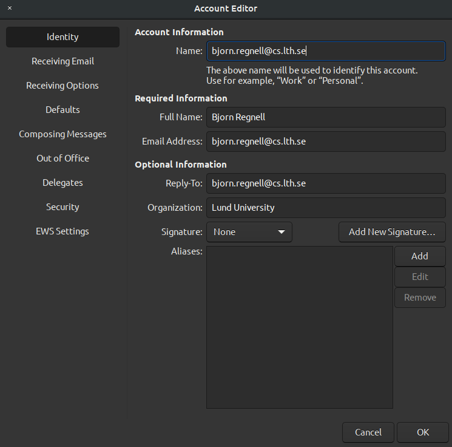
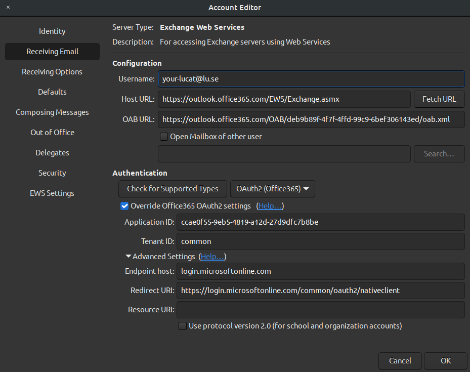
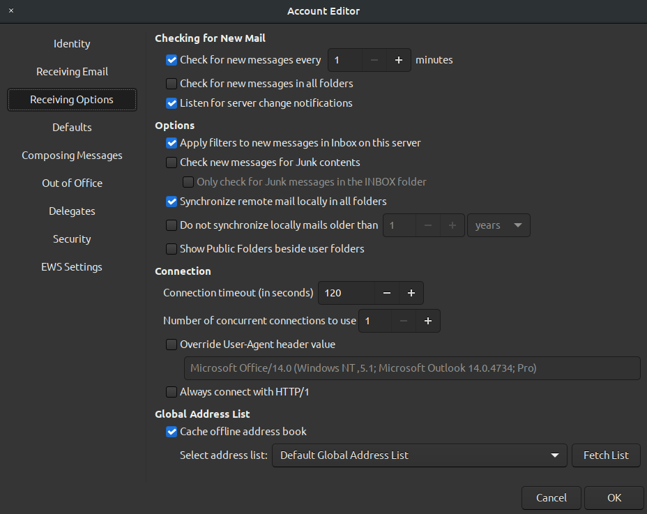
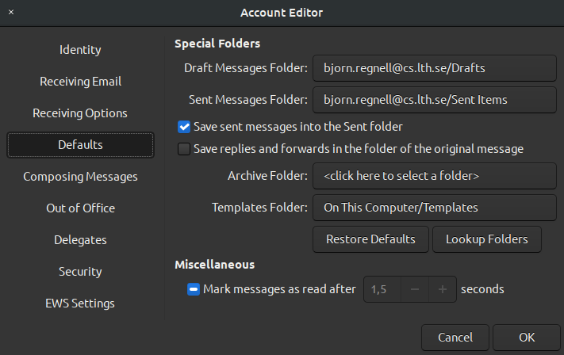
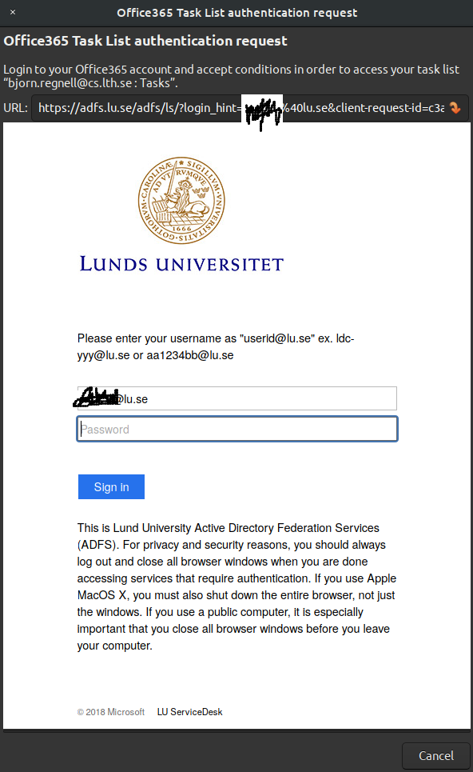
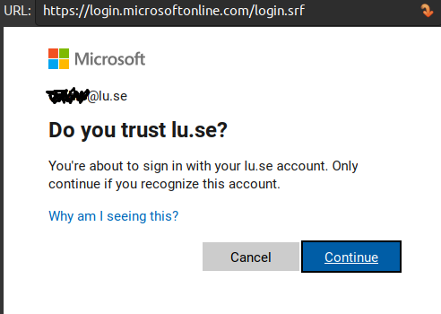

# Install and configure the Gnome Evolution email client

Gnome Evolution is an email client for Linux/Ubuntu that works with Microsoft Exchange servers.

It is easiest to configure using a backup of your existing Evolution instance on another machine as described below (if you have one). Otherwise, if you are doing a fresh install, use the settings below, see esp. the settings for OAuth2 below if your organisation uses that with Microsoft Office365. 

The configuration examples below are for employees and students at Lund University, Sweden - the configurations need to be adjusted according to your specifics if you are with another organisation.

If Gnome Evolution does not work for you, or if you want a backup solution, you may want to [install Outlook as a PWA using Edge on Linux](https://github.com/bjornregnell/ubuntu-tweaks/tree/master/edge-outlook-teams).

## Install flatpak version of Gnome Evolution

Install flatpak and flathub, see  https://www.omgubuntu.co.uk/2019/02/how-to-install-flatpak-on-ubuntu-flathub and https://wiki.gnome.org/Apps/Evolution/Flatpak
```
sudo add-apt-repository ppa:alexlarsson/flatpak

sudo apt update && sudo apt install flatpak

flatpak remote-add --if-not-exists flathub https://flathub.org/repo/flathub.flatpakrepo

sudo apt install gnome-software-plugin-flatpak

flatpak install flathub org.gnome.Evolution
flatpak config --set languages 'en;sv'

```


### Why not install with apt?

The Ubuntu package manager `apt` is not recommended as it installs an old version that does seem not to be updated with the latest MS Exchange stuff. It might for example give this strange error: 

`Error performing TLS handshake: The Diffie-Hellman prime sent by the server is not acceptable (not long enough)`

So I have found that THIS DOES NOT WORK: *sudo apt update && sudo apt install evolution evolution-ews* - so instead use the flatpak version as described in the previous section.


## Bootstrap form existing install

If you have another machine where you already have a working Gnome Evolution instance you can bootstrap another machine like so:
   * On the existing working installation: File -> Back up Evolution Data
Save file somewhere and transfer to this machine and use "Restore from backup in the wizard" or do:
   * On the new machine: File -> Restore Evolution Data

If you don't have a working installation continue with manual settings for OAuth2 below.


## Settings for OAuth2 with Microsoft EWS Office365 at Lund University

You need to use an Evolution-EWS account.

From January we switched abruptly from our own EWS hosting to Microsoft Azure hosting and settings needed to be updated as reflected below. The old deprecated settings are avaliable [here](https://github.com/bjornregnell/ubuntu-tweaks/tree/master/evolution-email-client/old-outdated-by-office365-swap).

You change the settings by right-clicking on your email account and select "Properties" to open the "Account Editor". Make sure settings are as follows.

### Settings for "Identity"

You should use your own public email as exemplified below:




### Settings for "Receiving Email" 

In the tab "Receiving Email" in the "Account Editor" use these values of each field:

* Username: `your-lucatid@lu.se`  (NOTE for Lund University employees/students: don't use your email but your Lucat or StilID)
* Host URL: `https://outlook.office365.com/EWS/Exchange.asmx`

* OAB URL:  `https://outlook.office365.com/OAB/deb9b89f-4f7f-4ffd-99c9-6bef306143ed/oab.xml`

- [x] Check "Override Office365 OAuth2 settings

* Application ID: `ccae0f55-9eb5-4819-a12d-27d9dfc7b8be`

* Tenant ID: `common`

Unfold the "Advanced Setting" part and set the fields as follows:

* Endpoint host: `login.microsoftonline.com`

* Redirect URI: `https://login.microsoftonline.com/common/oauth2/nativeclient`

Your settings for "Receiving Email" settings should look similar to this (if you are with Lund University):



NOTE: These settings were adapted from [here](https://hdkb.clemson.edu/phpkb/article.php?id=2668). These settings will not work if you are not an employee or student at Lund University with a LucatID - instead you may find your own organization's Application ID and Tenant ID by logging into your organization's MS Azure instance and look under Applications -> App Registrations and in the long list find the hash of `mail-oauth` as Application ID [here](https://entra.microsoft.com/#view/Microsoft_AAD_RegisteredApps/ApplicationsListBlade/quickStartType~/null/sourceType/Microsoft_AAD_IAM )  Perhaps if `common` does not work for your Tennant ID you may want to try the Tenant ID [from here](https://entra.microsoft.com/#view/Microsoft_AAD_IAM/TenantOverview.ReactView).

### Settings for "Receiving Options"

These are my settings, but you may want others:



### Settings for "Default"

As defaults might have changed you may need to update them similar as follows but with our own account name:



### Providing repeated authentication

When reconnecting with new settings you need to provide authentication many times for each service: email, global address list, contacts, etc.

Each time you must check that you have `your-lucat@lu.se" and NOTE that it should NOT be your email address. You must also everytime again and again for eternity confirm that you trust Lund University (if you do :) 

It looks like this (I have greeked my lucat-id):






## Modify the keyboard shortcuts of Gnome Evolution

List of shortcuts that I want to modify (see how to modify them below)

* `Alt-c ` focus search field, then enter to filter
* `Ctrl-j ` mark as junk
* `Ctrl-k ` mark as read
* `Ctrl-u ` mark as unread
* `1 ` mark as important
* `0 ` mark as important

How to modify:

https://defkey.com/evolution-linux-shortcuts

https://askubuntu.com/questions/1125058/how-to-change-evolutions-keyboard-shortcuts

1. Make sure that Evolution is not running.

2. Open the file ~/.config/evolution/accels with a text editor

3. Find the line for the command you want to edit, for example Reply to All which looks like:
; (gtk_accel_path "<Actions>/mail/mail-reply-all" "<Primary><Shift>r").

4. Here the spaces are only for indentation, but the semicolon at the beginning of the line comments-out the line.

5. Remove the semicolon and make your change so that line might look now like, for example: 
```
(gtk_accel_path "<Actions>/mail/mail-reply-all" "<Super>r")
```
6. Make sure you save, and then close the file in your text editor.

7. Now, re-open Evolution and you should see that the keyboard shortcut for Message->Reply to All has changed.

My mods are here https://github.com/bjornregnell/ubuntu-tweaks/raw/master/evolution-email-client/accels 


## DEPRECATED: Old settings for EWS:

See old settings from when we self-hosted EWS [here](https://github.com/bjornregnell/ubuntu-tweaks/tree/master/evolution-email-client/old-outdated-by-office365-swap).


