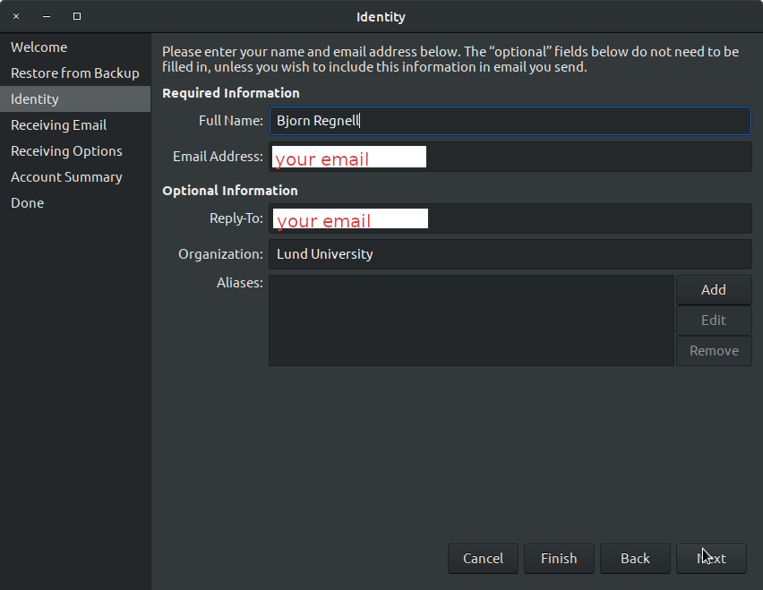
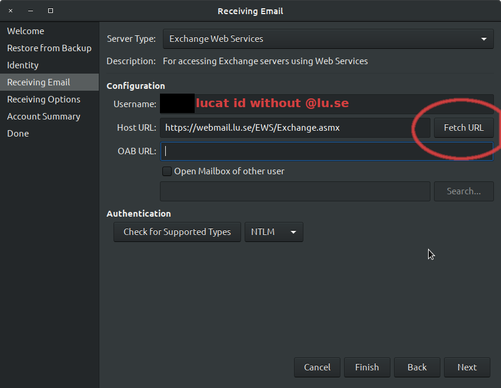
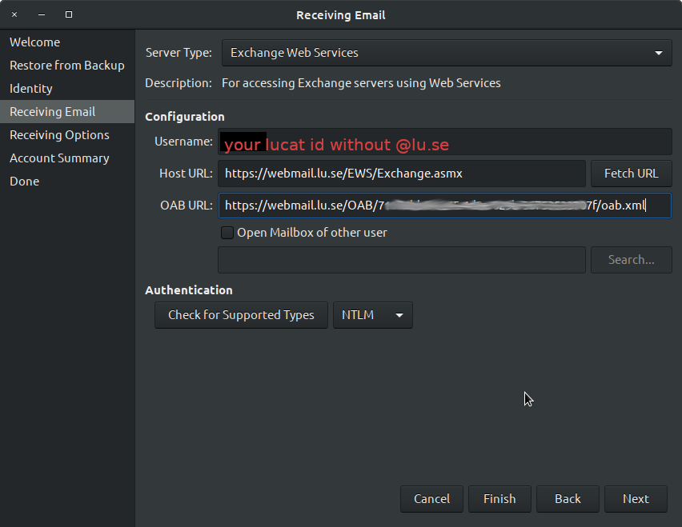
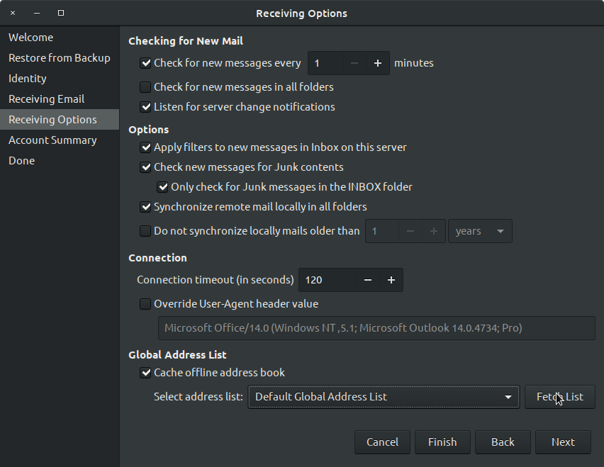
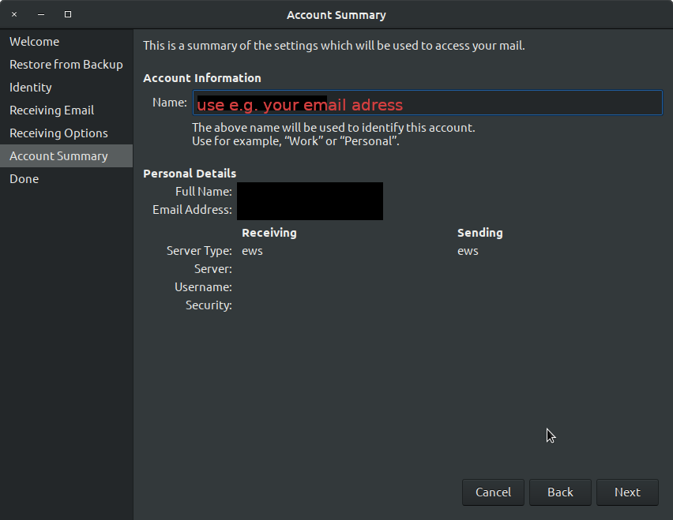
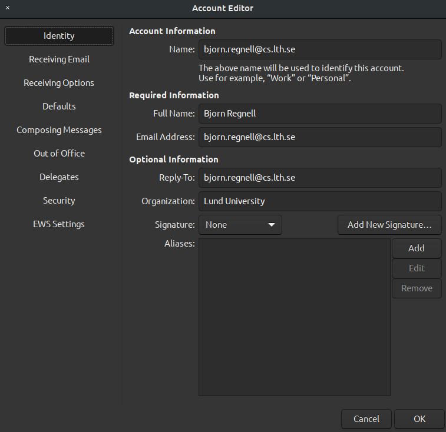
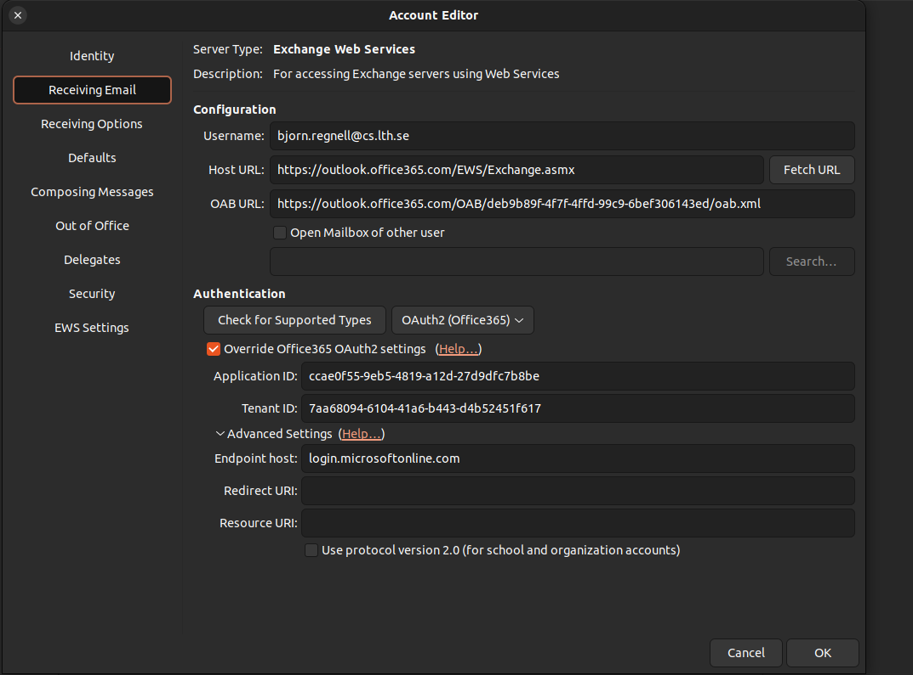
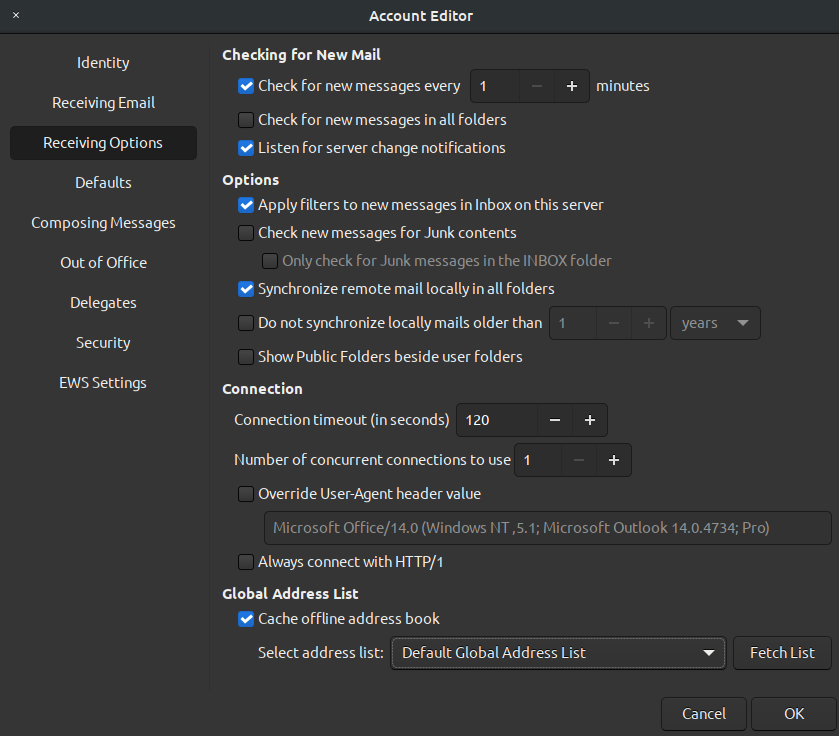

## DEPRECATED: Old settings for authentication NTLM

Before we switched to OAuth2 athentication and Office365 these were the old settings but it **DOES NOT work** anymore at Lund University:

### Wizard dialogs

In the "Receiving Email" step enter:

* Server Type: Exchange Web Services
* User Name: your lucat id without @lu.se
* Host URL: https://webmail.lu.se/EWS/Exchange.asmx
* Authentication, check for supported type: NTLM

Then press "Fetch URL".
The fetched URL is filled into the OAB URL field similar to 
https://webmail.lu.se/OAB/longhashnumberhere/oab.xml

After pressing "Fetch URL":

This is my settings in the Receiving Options:

This is how my Account Summary looks:

### Bad settings for Office365

I got these settings partly to work but they were wrong as they did not use the correct userid and did not use the right "Advanced Settings". See correct settings [here]().

