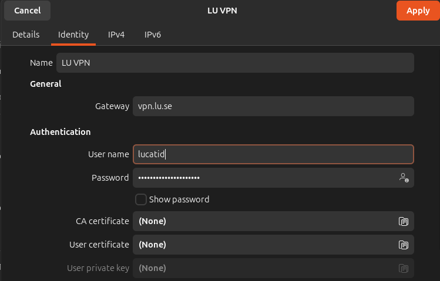
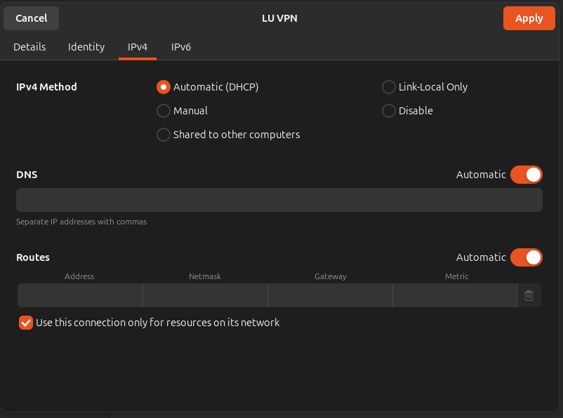

## How to access LU VPN on Linux/Debian Ubuntu

This guide is for students and employees at Lund University who want to access the internal university network securely via our Virtual Private Network. For newer ubuntu versions this can be done via built-in Network settings. VPN can also be used via a special gui app called FortiClient VPN, but it is more complicated.

**NOTE:** When you access the internet via LU VPN your traffic is monitored and you should only use it for school and work at LU and **not for private traffic**. For example, the IT Security Dept at LU LDC will not be pleased if you run torrent downloads or other heavy private traffic through the LU network.

## Using `openfortivpn` in terminal (recommended from 24.04)

1. Install this in terminal:
```
sudo apt install net-tools ubuntu-keyring
sudo apt install network-manager-fortisslvpn network-manager-fortisslvpn-gnome openfortivpn
```
2. Add your LUCATID to your `.bashrc` like so (id you haven't done so already):
```
export LUCATID="tts-bre"
```

2. Open a connection with `openfortivpn` and first enter sudo password then lucat password: 
```
sudo openfortivpn vpn.lu.se:443 --username=$LUCATID
```
You should see something similar to:
```
[sudo] password for <userid>: <enter sudo password>
VPN account password: <enter LUCATID password>
INFO:   Connected to gateway.
INFO:   Authenticated.
INFO:   Remote gateway has allocated a VPN.
Using interface ppp0
Connect: ppp0 <--> /dev/pts/5
INFO:   Got addresses: [172.20.52.2], ns [130.235.9.9, 130.235.63.228]
INFO:   Negotiation complete.
INFO:   Negotiation complete.
local  IP address 172.20.52.2
remote IP address 169.254.2.1
INFO:   Interface ppp0 is UP.
INFO:   Setting new routes...
INFO:   Adding VPN nameservers...
Dropped protocol specifier '.openfortivpn' from 'ppp0.openfortivpn'. Using 'ppp0' (ifindex=7).
INFO:   Tunnel is up and running.
```

3. Store your LUCATID password in safe keyring like so:
```
keyring set vpn-lu $LUCATID$
``` 
and enter password when asked. You can then in bash scripts access it like so:
```
echo $(keyring get vpn-lu ${LUCATID})
```

4. Download [this](TODO) convenient bash script and place in `~/bin/vpn-lu`
```
#!/bin/bash

VPN_CMD="sudo openfortivpn vpn.lu.se:443 --username=${LUCATID}"
green="\e[32m"
red="\e[31m"
reset="\e[0m"

if ifconfig ppp0 &> /dev/null; then
  ifconfig ppp0
  ip a show ppp0
  ip route | grep ppp0
  if pgrep -x openfortivpn >/dev/null; then
    echo -e "${green}VPN (openfortivpn) is running at PID $(pgrep -x openfortivpn)${reset}"
  fi
  curl www.ddg.lth.se/cgi-bin/showip
else
  echo "Attempting to start vpn in foreground of this shell"
  echo "to stop vpn use Ctrl-C"
  echo $VPN_CMD
  echo $(keyring get vpn-lu ${LUCATID}) | $VPN_CMD
fi
```
You can now start vpn by just typing `vpn-lu`


## Using bult in Ubuntu VPN settings (recommended from 22.04)

1. Install this in terminal:
```
sudo apt install net-tools
sudo apt install network-manager-fortisslvpn network-manager-fortisslvpn-gnome openfortivpn
```

2. Goto Settings -> Network 

3. Click on + to add VPN network
4. Select Fortinet SSLVPN
5. Select Identity Tab and chose a Name, e.g. LU VPN
6. Gateway: `vpn.lu.se`
7. User name: YOURLUCATID  (without @lu.se)



8. Select IPv4 tab and check **Automatic (DHCP)** and DNS **Automnatic** and Routes **Automatic** and **"Use this connection only for resources on its network"**




9. Click Add

10. Toggle ON to connect

11. Check with `ifconfig ppp0` in terminal that the connection was created. Output should be similar to:

```
$ ifconfig ppp0
ppp0: flags=4305<UP,POINTOPOINT,RUNNING,NOARP,MULTICAST>  mtu 1400
        inet 172.20.52.4  netmask 255.255.255.255  destination 169.254.2.1
        ppp  txqueuelen 3  (Point-to-Point Protocol)
        RX packets 109  bytes 1105 (1.1 KB)
        RX errors 0  dropped 0  overruns 0  frame 0
        TX packets 110  bytes 1137 (1.1 KB)
        TX errors 0  dropped 0 overruns 0  carrier 0  collisions 0

```


### Using the forticlient app (only recommended for ubuntu 20.04 or older)
* Install **FortiClient VPN** (there are a lot of products from Forticlient but you need the one called exactly just that to not get alot of stuff you dont want) by downloading this deb  https://links.fortinet.com/forticlient/deb/vpnagent also available here also including rpm, Windows etc: https://www.fortinet.com/support/product-downloads#vpn 
(for old Ubuntu < 18.04 see here https://www.forticlient.com/repoinfo  )

* Install the deb with `sudo apt install ./nameofdebyousavedhere.deb`

* Start the FortiClient app and:
  * Accept the terms and conditions
  * Click on "Configure VPN" and make sure "SSL-VPN" is selected 
  * Remote gateway: vpn.lu.se
  * The port should be: 443
  * Do **NOT** click on SSO
  * If you want you can give an optional name and description in "Connection name" (e.g. `LU VPN`) and "Description" (e.g. left blank).
  * Click Save
  * When you click "Remote access" you should now be able to enter your credentials. If you are a student or employee at LU then use your LucatID (example: ldc-abc without @lu.se)
  * You can test that your VPN-connection is working by opening this link in your web browser: [http://www.ddg.lth.se/cgi-bin/showip](http://www.ddg.lth.se/cgi-bin/showip) and the text shown on the first line should start with 130.235 if you are connected via the LU domain.
  
