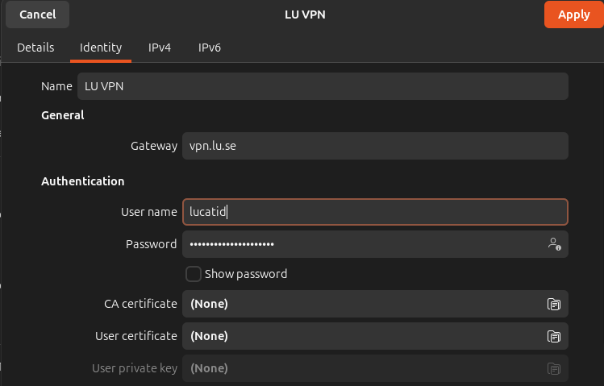

## How to access LU VPN on Linux/Debian Ubuntu

This guide is for students and employees at Lund University who want to access the internal university network securely via our Virtual Private Network. For newer ubuntu versions this can be done via built-in Network settings. VPN can also be used via a special gui app called FortiClient VPN, but it is more complicated.

**NOTE:** When you access the internet via LU VPN your traffic is monitored and you should only use it for school and work at LU and **not for private traffic**. For example, the IT Security Dept at LU LDC will not be pleased if you run torrent downloads or other heavy private traffic through the LU network.

## Using bult in Ubuntu VPN settings (recommended from 22.04)

1. Install this in terminal:
```
sudo apt install net-tools
sudo apt install network-manager-fortisslvpn network-manager-fortisslvpn-gnome openfortivpn
```

2. Goto Settings -> Network 

3. Click on + to add VPN network
4. Select Fortinet SSLVPN
5. Select Identity Tab and chose a Name, e.g. LU VPN
6. Gateway: `vpn.lu.se`
7. User name: YOURLUCATID  (without @lu.se)



8. Select IPv4 tab and check **Automatic (DHCP)** and DNS **Automnatic** and Routes **Automatic** and **"Use this connection only for resources on its network"**


9. Click Add

10. Toggle ON to connect

11. Check with `ifconfig ppp0` in terminal that the connection was created. Output should be similar to:

```
$ ifconfig ppp0
ppp0: flags=4305<UP,POINTOPOINT,RUNNING,NOARP,MULTICAST>  mtu 1400
        inet 172.20.52.4  netmask 255.255.255.255  destination 169.254.2.1
        ppp  txqueuelen 3  (Point-to-Point Protocol)
        RX packets 109  bytes 1105 (1.1 KB)
        RX errors 0  dropped 0  overruns 0  frame 0
        TX packets 110  bytes 1137 (1.1 KB)
        TX errors 0  dropped 0 overruns 0  carrier 0  collisions 0

```


### Using the forticlient app (only recommended for ubuntu 20.04 or older)
* Install **FortiClient VPN** (there are a lot of products from Forticlient but you need the one called exactly just that to not get alot of stuff you dont want) by downloading this deb  https://links.fortinet.com/forticlient/deb/vpnagent also available here also including rpm, Windows etc: https://www.fortinet.com/support/product-downloads#vpn 
(for old Ubuntu < 18.04 see here https://www.forticlient.com/repoinfo  )

* Install the deb with `sudo apt install ./nameofdebyousavedhere.deb`

* Start the FortiClient app and:
  * Accept the terms and conditions
  * Click on "Configure VPN" and make sure "SSL-VPN" is selected 
  * Remote gateway: vpn.lu.se
  * The port should be: 443
  * Do **NOT** click on SSO
  * If you want you can give an optional name and description in "Connection name" (e.g. `LU VPN`) and "Description" (e.g. left blank).
  * Click Save
  * When you click "Remote access" you should now be able to enter your credentials. If you are a student or employee at LU then use your LucatID (example: ldc-abc without @lu.se)
  * You can test that your VPN-connection is working by opening this link in your web browser: [http://www.ddg.lth.se/cgi-bin/showip](http://www.ddg.lth.se/cgi-bin/showip) and the text shown on the first line should start with 130.235 if you are connected via the LU domain.
  
